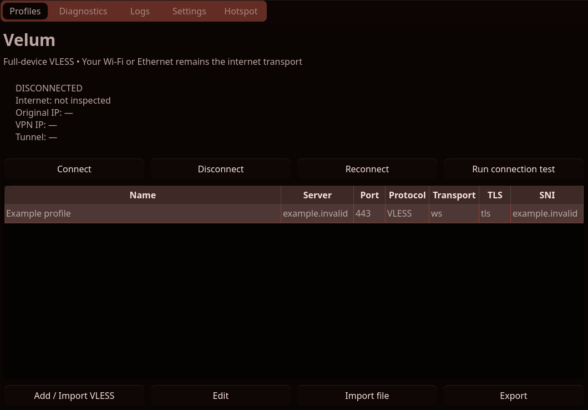

# Velum

A Linux desktop manager for user-supplied VLESS configurations, built with
Python, PySide6/Qt6, Xray, and an authorized networking service. Targets CachyOS,
Arch Linux, KDE Plasma, and systemd. MIT licensed.

**0.1.0 is a development release, not a production-certified VPN.** Real TCP/UDP
traffic through Xray/VLESS, IPv6 blocking, kill-switch behavior, and rollback have
passed isolated Linux namespace tests. An authorized live WebSocket/TLS provider session also passed Polkit/resolved
setup and independent non-root egress verification. Sleep/hotplug and physical
hotspot acceptance still need live validation.
See [test evidence and release gates](docs/TESTING.md).

This is only a client. Obtain your own service legally. No provider credentials,
subscriptions, account creation, or server exploitation are included.

## Screenshots

Actual Qt window rendered offscreen with a dummy, disconnected profile:



Qt follows your desktop palette. The screenshot is not evidence of a live VPN.

## Features

- Strict VLESS TCP and WebSocket import, with or without TLS. SNI, ALPN,
  fingerprint, WebSocket host/path, names, and original URIs are preserved.
- Optional certificate hostname separate from SNI, using Xray's
  `verifyPeerCertByName`; certificate verification remains enabled.
- Unknown, duplicate, invalid, or inapplicable options produce explicit errors.
- Add, edit, rename, duplicate, delete with confirmation, share/copy URL, import
  and export profile JSON, and export Xray JSON. Credentials are masked by default.
- Full-device IPv4 TUN, including UDP, using xjasonlyu/tun2socks and Xray.
- Physical upstream detection; endpoint pinning; independent policy routing;
  verified egress using multiple HTTPS services and ordinary system routing.
- Unprivileged GUI; Polkit-authorized, systemd-supervised privileged helper.
- Per-link systemd-resolved DNS; DNS interception; temporary IPv6 blocking;
  isolated nftables kill switch and optional existing-hotspot sharing.
- Explicit state machine, diagnostics, redacted structured logs, tray menu,
  desktop notifications, reconnect supervision, and write-ahead recovery journals.
- Atomic 0600 profile storage, 0700 runtime credentials, no shell evaluation of
  configuration values, and no automatic engine downloads.

## Architecture

```text
Qt GUI (your UID) ── private Unix connection / Polkit ── root session supervisor
                                                           │
Application sockets → vpn0 → tun2socks → local SOCKS → Xray → VLESS provider
                                                           │
                                                existing Wi-Fi / Ethernet
```

The loopback SOCKS listener is an internal adapter, not the application's VPN
mode. Applications use kernel routes through `vpn0`. Wi-Fi stays connected.
The physical default route is retained in `main`; policy table 28672 routes
ordinary IPv4 traffic through the tunnel. See [architecture](docs/ARCHITECTURE.md)
and [routing, DNS, and recovery](docs/NETWORKING.md).

## Installation: CachyOS / Arch

Run each stage only after the previous one succeeds. First update the system and
install the build/runtime dependencies:

```sh
sudo pacman -Syu --needed git base-devel python pyside6 python-build python-installer \
  python-setuptools ruff iproute2 nftables systemd polkit curl procps-ng \
  networkmanager polkit-kde-agent
```

If pacman reports a download or `.sig` **404**, fix the mirror/database problem
before continuing. On CachyOS, rerate mirrors with `sudo cachyos-rate-mirrors`,
then retry the command above. If the database still points to missing files,
use `sudo pacman -Syyu` to force a refresh and perform a full upgrade. See
[installation troubleshooting](docs/TROUBLESHOOTING.md#installation-fails-with-404-or-pkgbuild-does-not-exist).

Clone the repository and enter it (Bash and current Fish both support `&&`):

```sh
git clone https://github.com/rizhamhd/velum.git && cd velum
```

If you already cloned it, enter that existing `velum` directory instead. It must
contain `PKGBUILD`; downloading only the README or running from your home
directory will not work.

`PKGBUILD` builds the local checkout; it does not download a fictitious release.
Review and build your own Xray and xjasonlyu/tun2socks packages first. On the
CachyOS development machine, these are provided by `xray-bin` and
`tun2socks-bin`; package availability depends on your repositories/AUR choices.
They are runtime prerequisites even though PKGBUILD lists them as optional to
allow alternative package providers. Never substitute badvpn-tun2socks.

After installing those engines, build and install Velum as your ordinary user:

```sh
test -f PKGBUILD && makepkg -si
```

Only after `makepkg` finishes successfully, enable the service and launch the app:

```sh
sudo systemctl enable --now velum.socket && velum
```

For an already-built local package:

```sh
sudo pacman -U ./velum-vpn-0.1.0-6-any.pkg.tar.zst
sudo systemctl enable --now velum.socket
velum
```

Do not launch `velum` with sudo. KDE's Polkit agent handles authorization when
the GUI opens a helper connection. Closing/quitting the GUI keeps the VPN running,
including monitoring and automatic recovery. Reopen Velum to see its current
status; click **Disconnect** to end the VPN. Multiple authorized windows belonging
to the session's user can control the same VPN. Stopping the service or rebooting
still ends the session; the VPN does not automatically connect after reboot.

Connect, Disconnect, and Reconnect controls wait for the current operation to finish.
Reconnect applies the selected profile and current settings; invalid profile syntax
or unsupported settings are rejected before disconnecting the existing VPN.
After upgrading the package, restart `velum.service` and reopen the GUI to load the
new behavior. Restarting the service ends any current VPN connection.

### Xray setup

Install trusted packages yourself; Velum never downloads or executes downloaded
binaries. Confirm these executable paths and versions:

```sh
/usr/bin/xray version
/usr/bin/tun2socks -version
command -v ip nft resolvectl curl pkcheck
```

Tested engine versions: Xray 26.3.27 and xjasonlyu/tun2socks 2.6.0.
The helper validates every generated config with `xray run -test -config ...`
before network mutations. A separately running Xray service is not needed.

### DNS prerequisite

The initial resolver adapter supports **systemd-resolved's stub** only, including
NetworkManager delegating to it. Inspect before making any system changes:

```sh
readlink -f /etc/resolv.conf
resolvectl status
systemctl status systemd-resolved
```

The sole configured nameserver must be `127.0.0.53`, with resolved and its stub
listener running. Both stub symlinks and NetworkManager-generated regular files
are supported. External or mixed resolver lists are refused without modification. Follow
your distribution's resolved/NetworkManager setup guidance if migration is
needed; Velum does not replace `/etc/resolv.conf` automatically.

## Import and connect

1. Choose **Add / Import VLESS**, paste your provider's link, optionally name it,
   and save. Use **Import file** for Velum profile JSON, not arbitrary Xray JSON.
2. Select the profile. Review kill-switch and hotspot settings.
3. Click **Connect** and approve the desktop Polkit prompt.
4. Wait for **CONNECTED**. This requires engine, interface, route, DNS, firewall,
   system name resolution, HTTPS connectivity, and egress checks to pass.
5. Use **Run connection test** for individual results. Latency is the provider's
   TCP connection latency, not ICMP ping.

A normal remote VPN must change your public IP. The setting requiring this is on
by default and checks your original IP before connecting, using your physical
connection's data allowance. For an app-specific data package without general
internet access, turn off **Require public IP to change** to skip that pre-VPN
HTTPS check. This choice is saved across app restarts and also supports intentional
same-egress deployments. All tunnel routing, DNS, firewall, and connectivity
checks still apply, and two independent
HTTPS IP services must agree through the tunnel. The original IP is unavailable
in this mode, so a before/after comparison is not performed. Endpoint DNS and TCP
setup still use the physical connection. Velum cannot determine which ISP
allowance is charged; a successful VPN check does not verify package billing.

If your provider requires an SNI different from its certificate hostname, use
**Edit → Verify certificate for** to set the provider's certificate hostname.
The SNI, WebSocket Host/path, and other link options stay unchanged. Leaving this
field blank retains normal SNI/server certificate checks. This setting is saved
in the URL as `verifyPeerCertByName` and included in profile/Xray exports. The
tested Xray 26.3.27 rejects `allowInsecure=true`; Velum reports this explicitly
instead of silently ignoring it or changing SNI.

Imported credentials live in `$XDG_CONFIG_HOME/velum/profiles.json` (default
`~/.config/velum/profiles.json`). Exported profiles/Xray JSON contain credentials.
Copy/share explicitly warns that clipboard history can retain them.

## Hotspot sharing

Create an existing shared connection with KDE Network Settings / NetworkManager.
Velum does not create a hotspot or disconnect your upstream Wi-Fi. Your hardware
must support separate upstream and hotspot interfaces (or use Ethernet upstream).

Enable **Share VPN with an existing NetworkManager hotspot**, enter its interface,
and reconnect. Detection verifies it is an active NM connection with
`ipv4.method=shared`. Forwarding, return routing, DNS interception, and NAT are
configured in app-owned resources. Hotspot traffic is fail-closed while sharing
is enabled, including when desktop kill-switch mode is OFF.

The laptop can verify its rules, but **only testing from the phone verifies phone
egress**. Check that the phone's public IP matches Velum's VPN IP. IPv6 sharing is
blocked. Existing firewalls may prevent forwarding; Velum does not override them.

## Kill switch and IPv6

- **VPN only**: blocks ordinary physical IPv4 output except DHCP and marked
  provider TCP traffic. Default.
- **VPN + hotspot**: desktop protection plus sharing rules when sharing is enabled.
  Shared clients are always protected in either non-OFF mode.
- **OFF**: deliberately permits IPv4 fallback if routing disappears; DNS and IPv6
  protection remain. Use a non-OFF mode to prevent fallback.

Native IPv6 tunneling is not implemented. Temporary nftables IPv6 blocking is the
supported mode; selecting native tunneling produces an explicit error. IPv6
sysctls are not permanently changed. Local LAN bypass is not yet implemented.

Engine failure/network changes retain the guard while reconnecting. An explicit
disconnect or orderly service stop restores normal networking. GUI exit/crash keeps
the session and its protection running in the service.
An abrupt helper death retains journals/rules until authorized recovery or
reboot. See [failure behavior](docs/NETWORKING.md).

## Troubleshooting

```sh
systemctl status velum.socket velum.service
journalctl -u velum.service -b --no-pager
ip -4 route show table main
ip -4 rule show
ip -4 route show table 28672
ip -4 route get 1.1.1.1
ip -d link show vpn0
resolvectl status vpn0
sudo nft list table inet velum_vpn
curl -q --noproxy '*' -4 https://api.ipify.org
curl -q --noproxy '*' -6 --max-time 5 https://api64.ipify.org
```

During a protected connection IPv4 lookup should use `vpn0`; the IPv6 curl should
fail. `ip route` alone displays `main`, which intentionally retains your physical
default. A running Xray process alone is not proof of protection.

For stale app-owned resources, deliberately disconnect and restore normal routing:

```sh
sudo /usr/lib/velum/recover
sudo systemctl start velum.socket
```

Never flush the system firewall or delete unrelated routes. See the detailed
[troubleshooting guide](docs/TROUBLESHOOTING.md).

## Security considerations

This development release needs independent security review before production
reliance. The networking service and its child engines run with root privileges
inside a restricted systemd unit; the GUI does not. It authorizes the socket peer's
PID, UID, and process start time through Polkit. Only bounded validated requests
are accepted; no commands, executable paths, or arbitrary configuration files can
be submitted. Profiles are not encrypted at rest; file permissions protect them
from other ordinary users, not account compromise or root.

Logs redact VLESS URIs/UUIDs/common credential fields. Raw engine output is
suppressed rather than persisted. Public IP services learn the address used to
contact them; egress verification contacts multiple services about once per minute.
No telemetry or automatic updates are implemented. See [SECURITY.md](SECURITY.md).

## Development setup

```sh
./scripts/install-dev.sh
./scripts/run-dev.sh
./scripts/check.sh
```

Development GUI uses the **installed** helper for networking. Changing helper
source requires rebuilding/reinstalling the package; it never runs writable
checkout code as root. Unit tests mock network mutation and run Qt offscreen.

Explicit isolated kernel/packet tests (no host route modifications):

```sh
sudo ./scripts/integration.sh --root-network-namespace
# Alternative where unprivileged user namespaces are enabled:
./scripts/integration.sh --user-network-namespace
```

For repeatable acceptance with your own saved profile, see
[the live GUI test](docs/TESTING.md#repeatable-live-gui-acceptance). It exercises
the installed service, ordinary TCP/UDP traffic, reconnect, and network restoration.

Other modern Linux distributions need equivalent dependencies and installation of
the supplied systemd/Polkit files into their native paths; no non-Arch installer
has been validated.

## Current limitations

- Live provider testing covers one WebSocket/TLS profile; physical-hotspot and
  suspend/hotplug acceptance remain unverified.
- IPv4-capable upstream/provider required; IPv6 URLs parse, but IPv6-only endpoints
  cannot connect. IPv6 traffic is blocked instead of tunneled.
- Only TCP/WebSocket with none/TLS; REALITY, XHTTP, gRPC, flow, subscriptions,
  custom resolver managers, and coexistence with existing policy-routing VPNs
  are rejected or unavailable.
- Reconnect retries the pinned endpoint address. If provider DNS changes, use
  explicit reconnect to resolve it again.
- No automatic hotspot creation, configurable LAN bypass, persistence of settings
  other than the pre-VPN public-IP check,
  per-app split tunneling, or sing-box implementation yet.
- Hotspot diagnostics validate laptop configuration, not a phone's observed IP.

## Uninstall

```sh
sudo ./scripts/uninstall.sh
```

This recovers only journaled Velum resources and removes the package. Your saved
profiles remain. Do not delete the recovery journal before restoring networking.
